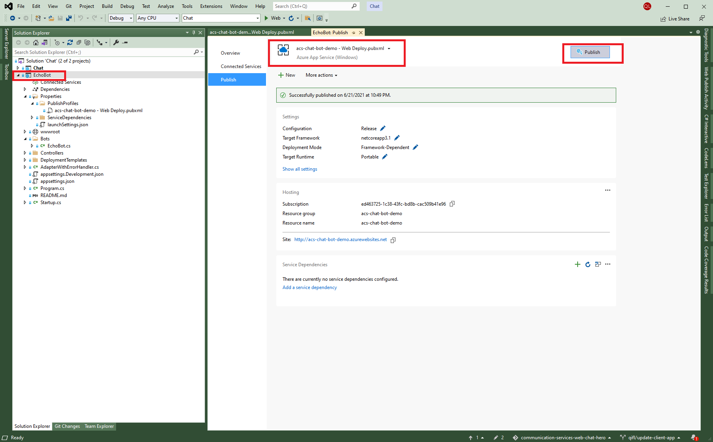

# Guidance

To play with an ABS bot, you need to tune the below settings before running the Chat app mentioned in the README file.

## Client App
This demo is expecting an INT ACS resource. Therefore, to receive the messages from INT environment, the following change need to be applied to ./ClientApp/node_modules/@azure/communication-signaling/dist-browser/azure-communicationservices-signaling.js

```js
    var defaultSettings = {
	    version: "1.0.0",
	    registrationId: "",
	    sessionId: "",
	    pnhAppId: "cns-e2e-test",
	    pnhTemplate: "cns-e2e-test:1.0",
	    platform: "SPOOL",
	    platformUIVersion: "0.0.0",
	    environment: "",
	    productName: "acs-chat-web",
	    trouterServiceUrl: "https://go.trouter-int.skype.net/v4/a",
		registrarServiceUrl: "https://edge.skype.net/registrar/testenv/v3/registrations",
		registrarRefreshTimeoutInMs: 350000,
	    timeoutOptions: {
	        connectionTimeoutMs: 20000,
	        fetchTimeoutMs: 10000,
	        pingTimeoutMs: 40000,
	        pongTimeoutMs: 5000,
	        maxBackoffMs: 50000,
	        requestTimeoutMs: 5000
	    },
	    maxRegistrationTimeInMs: 7200000
	}
```

## Backend Service

You also need to update the values of **ResourceConnectionString** and **BotAcsId**. For example, here are the values for demo purpose
| Key | Value |
| -- | -- |
| ResourceConnectionString | [acs-chat-bot-demo](https://df.onecloud.azure-test.net/#@acschatoutlook.ccsctp.net/resource/subscriptions/ad458bc1-b1ce-43fa-83f1-9d778d9c4f62/resourceGroups/chat-int-abs/providers/Microsoft.Communication/CommunicationServices/native-channel-demo/settings_keys) |
| BotAcsId | 8:acs:baf4879b-df79-46f2-b9c2-748ee32deadb_0000000a-d500-bc9d-dbb7-3a3a0d00111f |

## Echo Bot

The echo bot is located in folder `./Chat/EchoBot` which has a triggered using a keyword. To publish the bot, you can right click on the `EchoBot` project in VS and hit the publish button like below:



You can also find the `Configuration` of the application from [acs-chat-bot-demo | Configuration](https://ms.portal.azure.com/#@prdtrs01.onmicrosoft.com/resource/subscriptions/ed463725-1c38-43fc-bd8b-cac509b41e96/resourceGroups/acs-chat-bot-demo/providers/Microsoft.Web/sites/acs-chat-bot-demo/configuration).
